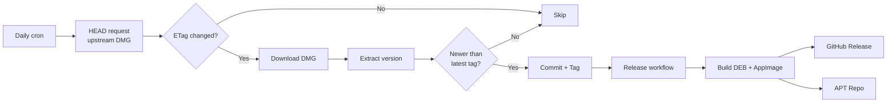

<div align="center">

# 🐧 Codex Desktop for Linux

**Unofficial native Linux packaging for OpenAI Codex Desktop**

[](https://github.com/cuongducle/codex-linux/releases/latest)
[](https://github.com/cuongducle/codex-linux/actions)
[](#-one-line-install)

Codex Desktop is OpenAI's AI-powered coding agent — built as an Electron app with **no official Linux release**. This project takes the upstream macOS build and repackages it as a native `.deb` / `.AppImage` for Linux, with proper Wayland support, native module rebuilds, and system integration.

</div>

---

## ⚡ Quick Install

### One-line install (Debian / Ubuntu)

```bash
curl -fsSL https://cuongducle.github.io/codex-linux/install.sh | sudo bash
```

### Manual `.deb` install

```bash
# Download latest from GitHub Releases
wget https://github.com/cuongducle/codex-linux/releases/latest/download/codex-desktop-$(curl -sL https://cuongducle.github.io/codex-linux/install.sh 2>/dev/null | head -1 | grep -oP 'codex-desktop-[\d.]+-linux-amd64' | head -1).deb -O codex-desktop.deb
sudo dpkg -i codex-desktop.deb
```

Or grab the latest `.deb` / `.AppImage` directly from [**Releases**](https://github.com/cuongducle/codex-linux/releases/latest).

### APT repository (auto-updates)

```bash
echo "deb [trusted=yes] https://cuongducle.github.io/codex-linux/ stable main" | sudo tee /etc/apt/sources.list.d/codex-desktop.list
sudo apt update && sudo apt install codex-desktop
```

### AppImage (any distro)

```bash
wget https://github.com/cuongducle/codex-linux/releases/latest/download/codex-desktop-linux-x86_64.AppImage
chmod +x codex-desktop-linux-x86_64.AppImage
./codex-desktop-linux-x86_64.AppImage
```

---

## ✨ Features

| Feature | Details |
|---|---|
| 🖥️ **Native Packaging** | `.deb` (Debian/Ubuntu) and `.AppImage` (any distro) |
| 🌐 **Wayland Support** | Auto-detects Wayland with native window decorations, falls back to X11 |
| 🏗️ **Native Modules** | Rebuilds `better-sqlite3` and `node-pty` from source for Linux |
| 🔄 **Auto-Updates** | Daily CI checks upstream, auto-tags and publishes new releases |
| 📦 **APT Repo** | One-line install with automatic updates via `apt upgrade` |
| 🛡️ **Sandbox** | Proper `chrome-sandbox` setuid + AppArmor `userns` profile (Ubuntu 24.04+) |
| 🔧 **Diagnostics** | Built-in `--doctor` command for troubleshooting |
| 🔗 **Deep-linking** | `x-scheme-handler/codex` protocol support |
| 🎨 **System Integration** | Desktop entry, icons, AppStream metainfo |
| 🔐 **Password Store** | Falls back to `basic` encryption when no keyring is available |
| 🧹 **Crash Recovery** | Auto-cleans stale `SingletonLock` on startup |
| 🚫 **No Update Noise** | Upstream autoUpdater replaced with no-op (no Linux artifacts) |

### Supported Platforms

- **Architecture**: `x86_64` (amd64) and `arm64`
- **Ubuntu**: 22.04+ (recommended: 24.04+)
- **Other distros**: via `.AppImage`

---

## 🎮 Usage

### Launch

```bash
codex-desktop
```

### Diagnostics

```bash
codex-desktop --doctor
```

Outputs display server, GPU, sandbox status, CLI resolution, platform info, and Electron version.

### Environment Variables

| Variable | Default | Description |
|---|---|---|
| `CODEX_USE_X11` | `0` | Force X11 (`1`) or auto-detect |
| `CODEX_USE_WAYLAND` | `0` | Force Wayland (`1`) or auto-detect |
| `CODEX_DISABLE_VULKAN` | `0` | Disable Vulkan (`1`) |
| `CODEX_GL_BACKEND` | `egl` | OpenGL backend (`egl`, `desktop`, `swiftshader`) |
| `CODEX_PASSWORD_STORE` | `basic` | Chromium password store |
| `CODEX_DISABLE_SANDBOX` | `0` | Disable Chromium sandbox (`1`) |
| `CODEX_CLI_PATH` | auto | Path to Codex CLI binary |

The app auto-detects your display server: if `WAYLAND_DISPLAY` is set, it launches with native Wayland support (including window decorations). Otherwise falls back to X11.

---

## 🏗️ How It Works

Codex Desktop is an **Electron app**. The vast majority of its code is cross-platform JavaScript, HTML, and CSS inside an `app.asar` archive. The only platform-specific parts are native Node modules.

**The packaging pipeline:**

1. **Download** the upstream macOS `.dmg` from OpenAI's CDN
2. **Extract** the `app.asar` and bundled resources (icons, CLI binary)
3. **Rebuild** native modules (`better-sqlite3`, `node-pty`) for the target Electron version and architecture
4. **Patch** the Electron app for Linux compatibility:
   - Disable `BrowserWindow` transparency (prevents black rectangles on software rendering)
   - Inject menu bar visibility fix
   - Replace upstream `autoUpdater` with a no-op (no Linux update feed)
   - Fix sidebar background rendering
5. **Package** as `.deb` / `.AppImage` via `electron-builder`
6. **Install** with proper sandbox permissions, AppArmor profile, and desktop integration

**Linux-specific workarounds applied:**

- Chromium sandbox gets `chown root:root; chmod 4755` in `postinst`
- AppArmor profile grants `userns` (Ubuntu 24.04+ blocks unprivileged user namespaces by default)
- Password store falls back to `basic` when `kwallet` / `gnome-keyring` is unavailable
- Stale `SingletonLock` symlinks are cleaned up on startup (prevents "app already running" false positives)

---

## 🔄 Auto-Update Pipeline



- **[`check-upstream.yml`](.github/workflows/check-upstream.yml)**: Runs daily, uses ETag-based change detection to avoid redundant downloads
- **[`release.yml`](.github/workflows/release.yml)**: Triggered by version tags, builds for both `x64` and `arm64`, publishes to GitHub Releases and APT repo on `gh-pages`

---

## 🛠️ Building from Source

```bash
# Clone the repo
git clone https://github.com/cuongducle/codex-linux.git
cd codex-linux

# Download upstream DMG
curl -fL "https://persistent.oaistatic.com/codex-app-prod/Codex.dmg" -o Codex.dmg

# Extract + rebuild native modules
bash scripts/setup.sh ./Codex.dmg

# Build packages
npm run build:linux      # both DEB + AppImage
npm run build:deb       # DEB only
npm run build:appimage  # AppImage only
```

Output artifacts are in `dist/`.

### Verifying a build

```bash
bash scripts/smoke-verify.sh
```

---

## 📂 Repository Structure

```
├── build/after-pack.js        # Electron post-pack: wrapper, CSS fixes, transparency patch
├── scripts/
│   ├── setup.sh                # DMG extraction + native module rebuild + local launcher
│   ├── build-packages.sh       # DEB/AppImage build via electron-builder
│   ├── build-apt-repo.sh       # Debian repository metadata generation
│   ├── generate-apt-install-script.sh  # Public install.sh generator
│   ├── get-codex-version.sh    # Extract version from DMG
│   ├── smoke-verify.sh         # Post-install smoke test
│   ├── internal/
│   │   ├── extract-dmg.sh      # DMG → app.asar extraction
│   │   └── build-native.sh     # better-sqlite3 + node-pty rebuild
│   └── debian/
│       ├── postinst            # DEB post-install (sandbox perms + AppArmor)
│       └── postrm              # DEB post-remove (AppArmor cleanup)
├── assets/
│   ├── icons/linux/            # Freedesktop icon set (16→512px)
│   └── metainfo/               # AppStream metainfo XML
├── electron-builder.yml         # Packaging configuration
├── .github/workflows/
│   ├── release.yml             # Build + publish on version tag
│   └── check-upstream.yml     # Daily upstream version check
└── README.md
```

---

## ⚠️ Notes

- This is an **unofficial** packaging project — not affiliated with OpenAI
- This repo does **not** redistribute Codex source; it builds from the upstream `.dmg`
- APT repo currently uses `trusted=yes` (unsigned repository)
- The Codex CLI must be installed separately — [install with curl](https://chatgpt.com/codex/install.sh): `curl -fsSL https://chatgpt.com/codex/install.sh | sh`

---

## 🙏 Credits

- [k3d3/claude-desktop-linux-flake](https://github.com/k3d3/claude-desktop-linux-flake) — Nix flake approach, inspiration for native addon stubbing and asar surgery techniques
- [aaddrick/claude-desktop-debian](https://github.com/aaddrick/claude-desktop-debian) — Debian packaging approach, inspiration for AppArmor profiles, Wayland handling, and Proxy-based Electron interception

---

<div align="center">
  <sub>Built with ❤️ for the Linux community</sub>
</div>
