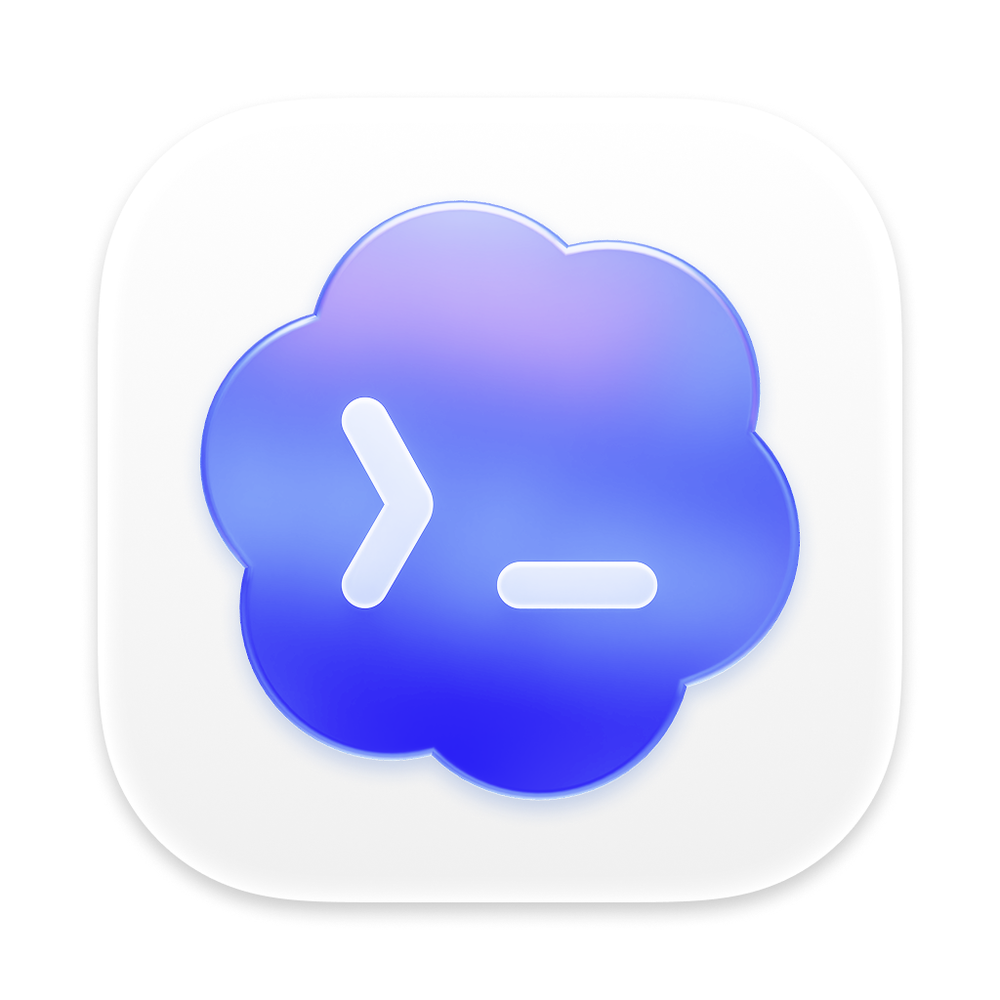
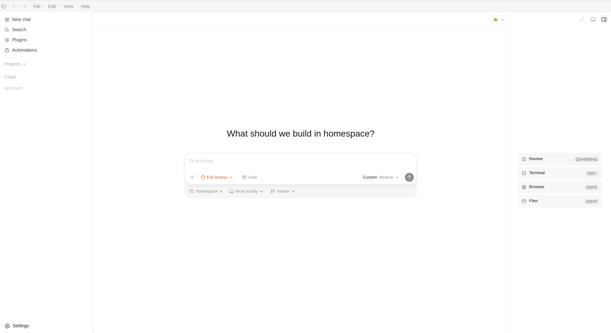
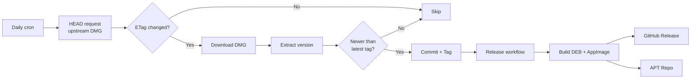

<div align="center">



# Codex Desktop for Linux

**Unofficial native Linux packaging for OpenAI Codex Desktop**

[](https://github.com/cuongducle/codex-linux/releases/latest)
[](https://github.com/cuongducle/codex-linux/actions)
[](#apt-repository-auto-updates)
[](#supported-platforms)

Codex Desktop is OpenAI's AI-powered coding agent — shipped as an Electron app with
**no official Linux release**. This project takes the upstream macOS build, patches it for
Linux, and repackages it as a native `.deb` and `.AppImage` — with Wayland support,
rebuilt native modules, sandbox handling, and full desktop integration.

</div>

> [!IMPORTANT]
> **THIS IS AN UNOFFICIAL BUILD. It is not affiliated with, endorsed by, or supported by OpenAI.**
> No Codex source code is redistributed here — this repo only contains the packaging scripts
> that build from the publicly available upstream macOS app. For the official product, see
> [openai.com/codex](https://openai.com/codex/). Use at your own risk.

---

## 📸 Screenshot

<div align="center">
  
  <br/>
  <sub>Codex Desktop running natively on Linux (Wayland)</sub>
</div>

---

## ✨ Features

| | Feature | Details |
|---|---|---|
| 🖥️ | **Native packaging** | `.deb` (Debian/Ubuntu) and `.AppImage` (any distro) |
| 🌐 | **Wayland support** | Auto-detects Wayland with native window decorations, falls back to X11 |
| 🏗️ | **Rebuilt native modules** | Compiles `better-sqlite3` and `node-pty` from source for Linux |
| 🔄 | **Auto-updates** | Daily CI checks upstream, auto-tags and publishes new releases |
| 📦 | **APT repo** | One-line install with updates via `apt upgrade` |
| 🛡️ | **Sandbox handling** | `chrome-sandbox` setuid + AppArmor `userns` profile (Ubuntu 24.04+) |
| 🔧 | **Diagnostics** | Built-in `--doctor` command for troubleshooting |
| 🔗 | **Deep-linking** | `x-scheme-handler/codex` protocol support |
| 🎨 | **System integration** | Desktop entry, icon set, AppStream metainfo |
| 🔐 | **Keyring fallback** | Falls back to `basic` encryption when no keyring is available |
| 🧹 | **Crash recovery** | Auto-cleans stale `SingletonLock` on startup |

### Supported platforms

- **Architecture:** `x86_64` (amd64) and `arm64`
- **Ubuntu / Debian:** 22.04+ (recommended 24.04+) via `.deb`
- **Any other distro:** via `.AppImage`

---

## ⚡ Installation

### APT repository (auto-updates)

The recommended path on Debian/Ubuntu — you get updates through `apt upgrade`:

```bash
echo "deb [trusted=yes] https://cuongducle.github.io/codex-linux/ stable main" \
  | sudo tee /etc/apt/sources.list.d/codex-desktop.list
sudo apt update && sudo apt install codex-desktop
```

### One-line install

```bash
curl -fsSL https://cuongducle.github.io/codex-linux/install.sh | sudo bash
```

### Manual `.deb`

Grab the latest `.deb` from [**Releases**](https://github.com/cuongducle/codex-linux/releases/latest), then:

```bash
sudo dpkg -i codex-desktop-*.deb
sudo apt-get install -f   # pull in any missing dependencies
```

### AppImage (any distro)

```bash
wget https://github.com/cuongducle/codex-linux/releases/latest/download/codex-desktop-linux-x86_64.AppImage
chmod +x codex-desktop-linux-x86_64.AppImage
./codex-desktop-linux-x86_64.AppImage
```

> [!NOTE]
> The Codex CLI is a separate tool. Install it with:
> `curl -fsSL https://chatgpt.com/codex/install.sh | sh`

---

## 🎮 Usage

Launch from your app menu, or from a terminal:

```bash
codex-desktop
```

### Diagnostics

```bash
codex-desktop --doctor
```

Prints display server, GPU, sandbox status, CLI resolution, platform info, and Electron version —
the first thing to run when something misbehaves.

### Environment variables

| Variable | Default | Description |
|---|---|---|
| `CODEX_USE_X11` | `0` | Force X11 (`1`) or auto-detect |
| `CODEX_USE_WAYLAND` | `0` | Force Wayland (`1`) or auto-detect |
| `CODEX_DISABLE_VULKAN` | `0` | Disable Vulkan (`1`) |
| `CODEX_GL_BACKEND` | `egl` | OpenGL backend (`egl`, `desktop`, `swiftshader`) |
| `CODEX_PASSWORD_STORE` | `basic` | Chromium password store backend |
| `CODEX_DISABLE_SANDBOX` | `0` | Disable Chromium sandbox (`1`) |
| `CODEX_CLI_PATH` | auto | Path to the Codex CLI binary |

By default the app inspects `WAYLAND_DISPLAY`: if set, it launches with native Wayland
(including window decorations); otherwise it falls back to X11.

---

## 🏗️ How It Works

Codex Desktop is an **Electron application**. The overwhelming majority of its code is
cross-platform JavaScript, HTML, and CSS living inside an `app.asar` archive — the only
truly platform-specific parts are a couple of native Node modules. That makes it a good
candidate for repackaging: pull the macOS build apart, rebuild the native bits for Linux,
patch a few rough edges, and re-wrap it.

**The packaging pipeline:**

1. **Download** the upstream macOS `.dmg` from OpenAI's CDN
2. **Extract** the `app.asar` and bundled resources (icons, CLI binary)
3. **Rebuild** native modules (`better-sqlite3`, `node-pty`) for the target Electron version and architecture
4. **Patch** the app for Linux:
   - Disable `BrowserWindow` transparency (prevents black rectangles on software rendering)
   - Inject menu-bar visibility fix
   - Replace the upstream `autoUpdater` with a no-op (there's no Linux update feed)
   - Fix sidebar background rendering
5. **Package** as `.deb` / `.AppImage` via `electron-builder`
6. **Install** with proper sandbox permissions, an AppArmor profile, and desktop integration

**Linux-specific workarounds applied during install:**

- `chrome-sandbox` is given `chown root:root && chmod 4755` in `postinst`
- An AppArmor profile grants `userns` (Ubuntu 24.04+ blocks unprivileged user namespaces by default)
- The password store falls back to `basic` when `kwallet` / `gnome-keyring` is unavailable
- Stale `SingletonLock` symlinks are cleaned on startup (prevents "app already running" false positives)

---

## 🔄 Auto-Update Pipeline



- **[`check-upstream.yml`](.github/workflows/check-upstream.yml)** — runs daily, uses ETag-based change detection to avoid redundant downloads
- **[`release.yml`](.github/workflows/release.yml)** — triggered by version tags, builds `x64` and `arm64`, publishes to GitHub Releases and the APT repo on `gh-pages`

---

## 🛠️ Building from Source

```bash
# Clone
git clone https://github.com/cuongducle/codex-linux.git
cd codex-linux

# Download the upstream DMG
curl -fL "https://persistent.oaistatic.com/codex-app-prod/Codex.dmg" -o Codex.dmg

# Extract + rebuild native modules + set up local launcher
bash scripts/setup.sh ./Codex.dmg

# Build packages
npm run build:linux      # DEB + AppImage
npm run build:deb        # DEB only
npm run build:appimage   # AppImage only
```

Artifacts land in `dist/`.

### Verify a build

```bash
bash scripts/smoke-verify.sh
```

---

## 📂 Repository Structure

```
├── build/after-pack.js          # Electron post-pack: wrapper, CSS fixes, transparency patch
├── scripts/
│   ├── setup.sh                  # DMG extraction + native rebuild + local launcher
│   ├── build-packages.sh         # DEB/AppImage build via electron-builder
│   ├── build-apt-repo.sh         # Debian repository metadata generation
│   ├── generate-apt-install-script.sh  # Public install.sh generator
│   ├── get-codex-version.sh      # Extract version from DMG
│   ├── smoke-verify.sh           # Post-install smoke test
│   ├── internal/
│   │   ├── extract-dmg.sh        # DMG → app.asar extraction
│   │   └── build-native.sh       # better-sqlite3 + node-pty rebuild
│   └── debian/
│       ├── postinst              # DEB post-install (sandbox perms + AppArmor)
│       └── postrm                # DEB post-remove (AppArmor cleanup)
├── assets/
│   ├── icons/                    # Freedesktop icon set (16→512px)
│   ├── screenshots/              # README screenshots
│   └── metainfo/                 # AppStream metainfo XML
├── electron-builder.yml          # Packaging configuration
├── .github/workflows/
│   ├── release.yml               # Build + publish on version tag
│   └── check-upstream.yml        # Daily upstream version check
└── README.md
```

---

## ⚠️ Notes & Caveats

- This is an **unofficial** project — not affiliated with OpenAI.
- It does **not** redistribute Codex source; it builds from the upstream `.dmg`.
- The APT repo currently uses `trusted=yes` (unsigned repository).
- The Codex CLI must be installed separately (see [Usage](#-usage)).

---

## 🙏 Credits

This project stands on the shoulders of the Linux community's earlier work packaging
Electron-based AI desktop apps:

- **[k3d3/claude-desktop-linux-flake](https://github.com/k3d3/claude-desktop-linux-flake)** — Nix flake approach; inspiration for native-addon stubbing and `app.asar` surgery techniques.
- **[aaddrick/claude-desktop-debian](https://github.com/aaddrick/claude-desktop-debian)** — Debian packaging approach; inspiration for AppArmor profiles, Wayland handling, and Proxy-based Electron interception.

---

<div align="center">
  <sub>Built with ❤️ for the Linux community · Codex™ is a trademark of OpenAI</sub>
</div>
